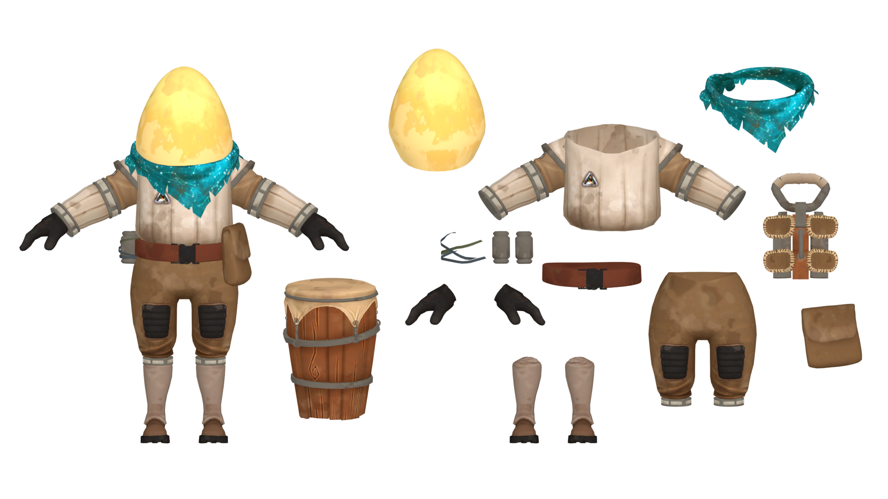

---
outline:
    level: 'deep'
---

# Chert
Astronomy 101: Maybe looking up isn't always the best idea

## Outfit Breakdown

[Link to Full Size](./media/Breakdown.webp)

## Prop List
* [Helmet](#helmet)
* [Bandana](#bandana)
* [Jumpsuit](#jumpsuit)
* [Back Harness](#back-harness) 
* Gloves
* Belt
    * [Pouch](#pouch)
    * Bottle *x2*
    * Bottle Straps *x3*
* [Pants](#pants)
* Boots
* [Drum](#drum)

## Model Turnarounds

### Helmet
<TransparentVideo path='helmet'/>

### Bandana
<TransparentVideo path='bandana'/>

### Jumpsuit
<TransparentVideo path='shirt'/>

### Back Harness
<TransparentVideo path='back harness'/>

### Pants
<TransparentVideo path='pants'/>

### Pouch
<TransparentVideo path='bag'/>

### Drum
<TransparentVideo path='drum'/>