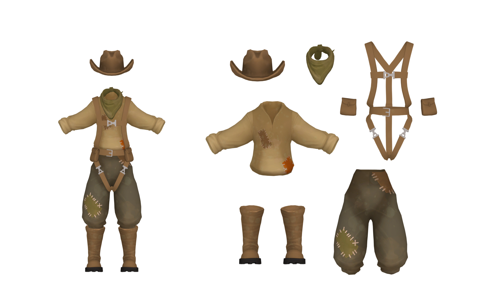

---
outline:
    level: 'deep'
---

# Esker
> “Oh, hey, it’s you! Ground control didn’t tell me you were launching. Long time no see!"

## Outfit Breakdown

[Link to Full Size](./media/Untitled.png)

## Prop List
* Hat
* Scarf
* [Shirt](#shirt) 
    * Brown Patch
    * Orange Patch
    * Purple Patch
    * Green Patch *x2*
* [Pants](#pants)
* Harness
    * [Pouch *x2*](#pouch)   
* Boots

## Model Turnarounds

### Shirt
<TransparentVideo path='esker/shirt'/>

### Pants
<TransparentVideo path='esker/pants'/>

### Pouch
<TransparentVideo path='esker/bag'/>