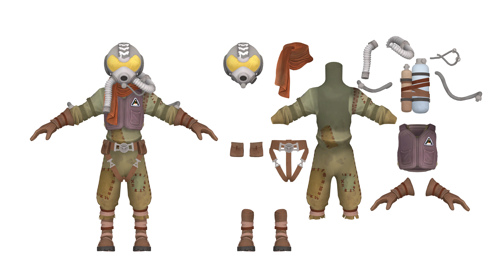

---
outline:
    level: 'deep'
---

# Feldspar
> “Whoa! Where’d you come from? No one’s come here in… well, ever, actually. That makes you the second Hearthian to ever reach Dark Bramble — after me, of course. Well done!"

## Outfit Breakdown

[Link to Full Size](./media/Breakdown.webp)

## Prop List
* [Helmet](#helmet)
    * Tubing *x2*
* [Scarf](#scarf)
* [Jumpsuit](#jumpsuit)
    * Tubing *x1*
* [Vest](#vest)
* [Bottles *x2*](#bottles)
    

    
Blue Bottle <i>(Click for More Info)</i>

    * Tubing *x1*

    * Black Straps *x2*
    * Maroon Straps *x2*
    * Light Brown Straps *x1*
    
    

    

    
Brown Bottle <i>(Click for More Info)</i>

    * Tubing *x1*

    * Black Straps *x2*
    * Maroon Straps *x1*
    * Light Brown Straps *x3*

    

    

    
Large Straps <i>(Click for More Info)</i>

    * Maroon Strap *x1*
    * Light Brown Strap *x1*
    
    

    

    
Total Straps: 13 <i>(Click for More Info)</i>

    * Total Straps:
        * Black *x4*
        * Maroon Straps *x3*
        * Light Brown Straps *x4*
        * Large Marron Strap *x1*
        * Large Brown Strap *x1*
    
    

* Gloves
* [Harness](#harness)
    * [Pouch *x2*](#pouch)
* Boots
    * 2 Maroon Staps (per boot)
    * 4 Light Brown Staps (per boot)

## Model Turnarounds

### Helmet
<TransparentVideo path='feldspar/helmet'/>

### Scarf
<TransparentVideo path='feldspar/scarf'/>

### Jumpsuit
<TransparentVideo path='feldspar/jumpsuit'/>

### Vest
<TransparentVideo path='feldspar/vest'/>

### Bottles
<TransparentVideo path='feldspar/bottles'/>

### Harness
<TransparentVideo path='feldspar/harness'/>

### Pouch
<TransparentVideo path='feldspar/pouch'/>