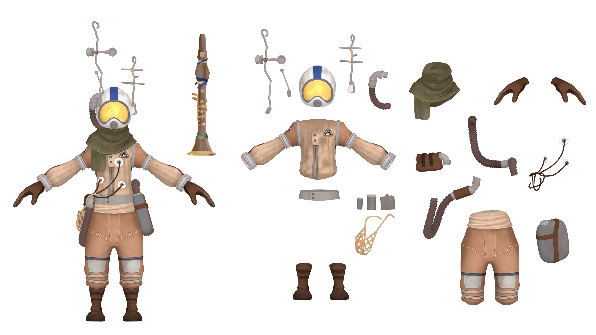

---
outline:
    level: 'deep'
---

# Gabbro
> "Good to see you made it here in one piece. The first solo launch is a doozy, isn’t it?
So hey, don’t laugh, but I think I might have had some kind of spiritual experience with a rock shaped like a face."

## Outfit Breakdown

[Link to Full Size](./media/Breakdown.webp)

## Prop List
* [Helmet](#helmet)
    * [Antenna 1](#antenna-1)
    * [Antenna 2](#antenna-2)
    * [Antenna 3](#antenna-3)
    * Tubing
* Scarf
* [Jumpsuit](#jumpsuit)
    * Wiring *x3*
    * Tubing *x2*
* Belt
    * Rope Pouch
        * [Wiring Bag](#wiring-bag)
        * Flask
        * Small Bottle *x2*
    * Large Bottle
* [Pants](#pants)
* Boots
* [Flute](#flute)

## Model Turnarounds

### Helmet
<TransparentVideo path='gabbro/helmet'/>

### Antennas

#### Antenna 1
<TransparentVideo path='gabbro/antenna 1'/>

#### Antenna 2
<TransparentVideo path='gabbro/antenna 2'/>

#### Antenna 3
<TransparentVideo path='gabbro/antenna 3'/>

### Jumpsuit
<TransparentVideo path='gabbro/jumpsuit'/>

### Wiring Bag
<TransparentVideo path='gabbro/wiring bag'/>

### Pants
<TransparentVideo path='gabbro/pants'/>

### Flute
<TransparentVideo path='gabbro/flute'/>