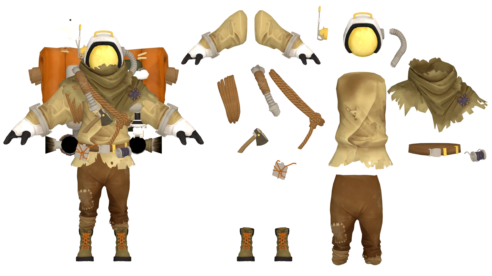

---
outline:
    level: 'deep'
---

# Hatchling
> It's you!

## Outfit Breakdown

[Link to Full Size](./media/Breakdown.webp)

## Prop List
* [Helmet](#helmet)
    * [Antenna](#antenna)
    * Tubing
* [Scarf](#scarf)
* [Shirt](#shirt)
    * Rope Loop
    * Tubing
    * Rope Sash
    * Hatchet / Axe w/ Cover
* [Backpack (References on seperate page)](./Backpack.md)
* Belt
    * Rope Pouch
        * Flask
    * Twine Loop
* [Pants](#pants)
* Boots

## Model Turnarounds

### Helmet
<TransparentVideo path='hatchling/helmet'/>

### Antenna
<TransparentVideo path='hatchling/antenna'/>

### Scarf
<TransparentVideo path='hatchling/scarf'/>

### Shirt
<TransparentVideo path='hatchling/shirt'/>

### Pants
<TransparentVideo path='hatchling/pants'/>