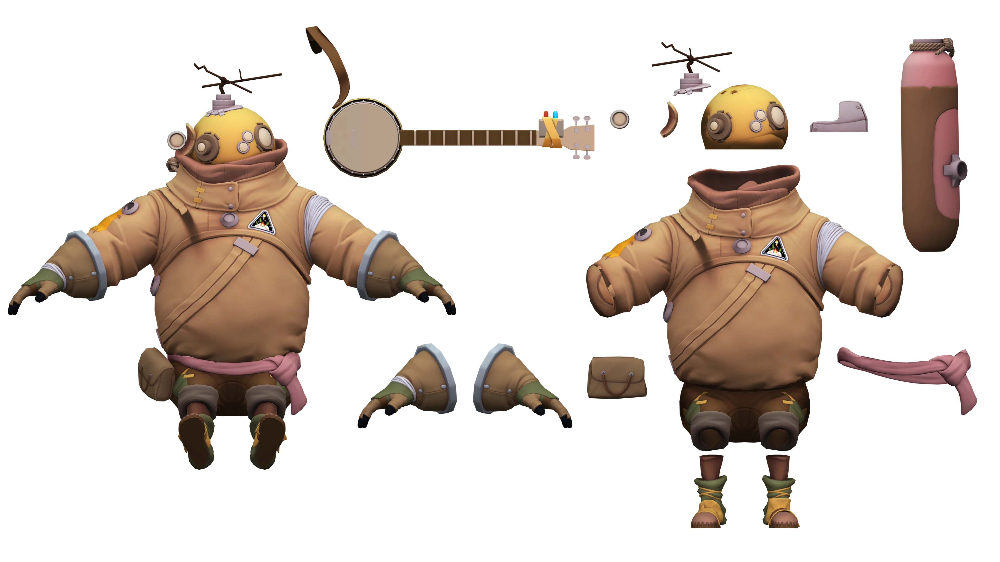

---
outline:
    level: 'deep'
---

# Riebeck
> “Oh, you launched! That’s great. Great job, you. Wow, I guess that means I’ve been out here a while, huh. Well, um, this is Brittle Hollow. But you probably knew that. Lots of history here. ...It’s great.”

## Outfit Breakdown

[Link to Full Size](./media/Breakdown.webp)

## Prop List
* [Helmet](#helmet)
    * [Antenna](#antenna)
    * [Flashlight Holder](#flashlight-holder)
        * [Flashlight](#flashlight)
* [Jumpsuit](#jumpsuit)
    * [Bottle](#bottle)
* [Belt](#belt)
    * [Bag](#bag)
* Boots
* Pants
* Boots
* [Banjo](#banjo)
    * Transmitter

## Model Turnarounds

### Helmet
<TransparentVideo path='riebeck/helmet'/>

### Antenna
<TransparentVideo path='riebeck/antenna'/>

### Flashlight Holder
<TransparentVideo path='riebeck/flashlight holder'/>

### Flashlight
<TransparentVideo path='riebeck/flashlight'/>

### Jumpsuit
<TransparentVideo path='riebeck/jumpsuit'/>

### Bottle
<TransparentVideo path='riebeck/bottle'/>

### Belt
<TransparentVideo path='riebeck/belt'/>

### Bag
<TransparentVideo path='riebeck/bag'/>

### Banjo
<TransparentVideo path='riebeck/banjo'/>